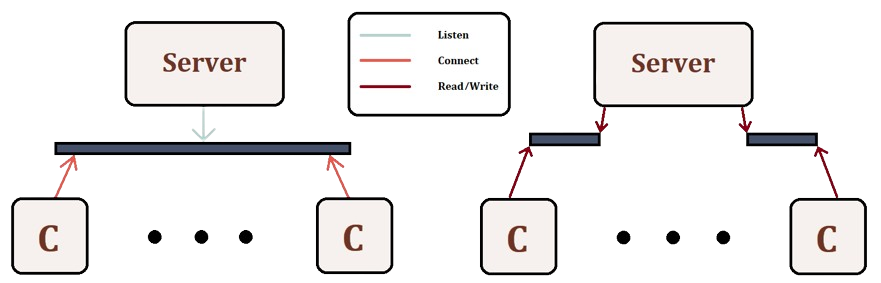

# Multithreaded Job Executor Server

### Communication

In this section, we will examine how a `jobCommander` (commander), which issues requests, communicates with the `jobExecutorServer` (server), responsible for handling them. This inter-process communication is facilitated through **sockets**.

A visual representation of the communication can be seen in below:



Specifically:
- **Requests**: To manage requests, we configured a **public** socket on the server to listen for incoming connections on a specific port of the host device. This socket is solely used to accept connection requests from the commanders. We use stream-based communication (`SOCK_STREAM`) through the TCP protocol, ensuring that the connection remains open and allows for continuous communication until it is terminated by one of the parties or a network error occurs. A **private** socket is then established for the actual communication with each specific client.

- **Commander**: Initially, using the `connect` syscall, the commander establishes a private communication endpoint. Subsequently, via the private socket, the client sends the type of command to be executed along with the necessary arguments and receives the server's response to that specific request.

- **Server**: The server is responsible for receiving requests from commanders, processing them, and sending the appropriate response through the private socket. It also manages the termination of communication by closing the corresponding socket.

### Server Logic

#### Main Thread

##### Initialization and Request Management

The main thread of the server handles the initialization tasks, including setting up the public socket, creating mutexes and condition variables, and spawning the specified number of *worker* threads. Once initialized, it enters an infinite loop to accept connections, spawns a *controller* thread for each request, and repeats the process.

##### Shutdown Protocol

To enable graceful termination, during initialization, we override the default behavior of the `SIGUSR1` signal. Upon receiving a `SIGUSR1`, we set a flag indicating that the server must halt its operations to true and close the public socket. Closing the socket within the signal handler prevents undefined behavior that may occur if an `accept4` system call is in progress. Additionally, subsequent calls to `accept4` will fail, allowing the main thread to exit the loop. Afterward, it adheres to the termination protocol outlined in the assignment, which involves stopping jobs waiting in the ready queue and waiting for all *controller* and *worker* threads to terminate. At the end of its tasks, it joins the *worker* threads and handles memory deallocation.

#### Controller Threads

A *controller* thread is tasked with managing incoming requests from a commander. It first detaches itself from the main program and then awaits for the commander to specify the type of job to be executed, subsequently carrying out the corresponding functionality.

Below, we will outline the functionality and communication protocols for each command:
- `issueJob`: Upon receiving the command line arguments, the *controller* thread implements the producer aspect of the producer-consumer problem. Subsequently, it notifies the commander either that the job has been successfully submitted or, in the event of server termination before the job's submission, communicates this status accordingly.

- `setConcurrency`: After receiving the new concurrency level from the commander, it updates the server's internal state accordingly. A signal is then broadcasted to the *worker* threads, instructing them to start executing additional jobs if possible. Lastly, the appropriate response is sent back to the commander.

- `stop`: Once the *controller* receives the `job ID` from the commander, it will attempt to remove it from the ready queue and send back the appropriate message. If the job is found and removed, the issuing commander will be notified that the job has been terminated.

- `poll`: Cycles through the ready queue, sending the description of each job to the commander.

- `exit`: If required, signals (`SIGUSR1`) the main thread to inform it to reject incoming connections and then sends the termination message to the commender.

#### Worker Threads

The *worker* thread operates as the consumer in the afformentioned problem. When a job is popped from the ready queue, a new process is created for its execution. This newly created process initially employs `dup2` to redirect the `stdout` and `stderr` streams to the respective `.output` file, followed by a call to `execvp` to carry out the command. The parent process (*worker* thread) waits for the child process to terminate, then iteratively sends all segments of the file to the commander.


### Compilation and Testing

A makefile has been created to facilitate seperate compilation. The rules to create the `jobExecutorServer` and `jobCommander` are `server` and `commander` respectivelly. Additionally, by not specifying a rule, you can compile both the server and the commander, as well as `progDelay.c`. Specifically:
```
$ make server 
$ make commander
$ make
```

The server requires $3$ parameters: the **port** to listen to, the **buffer size**, and the **thread pool size**. The commander, on the other hand, requires a minimum of $4$ parameters. The first $3$ parameters specify the **IP address** the server is running on, the **port** it listens to, and the **command type** respectively. If the command type requires additional arguments, they can be provided *afterwards*. Specifically:
```
$ ./bin/jobExecutorServer <portNum> <bufferSize> <threadPoolSize>
$ ./bin/jobCommander <serverName> <portNum> issueJob <command>
```

There are multiple tests available to verify the accuracy of our implementation, and they can be found in the directory `./tests/scripts/`. To run all the tests simultaneously, you can utilize the provided commands:
```
$ make ssh_setup
$ make test_cases
```

The former involves creating an SSH key to connect to other Linux lab machines at the university. You can choose to reuse an existing key, but it is important that the key does not have a passphrase, as the test cases use SSH to connect to the specified host and start a server. The latter initially grants execution permissions to the test scripts and runs them all. The outcomes can be found in the `./tests/results/` directory.

Finally, you can utilize the rule `clean` to remove all files created from performing any of the mentioned actions.

> [!NOTE]
> - Additionally to the file structure given, we utilize the folder `out` to temporarly create the `.output` files when executing a job.
> - There is a possibility of an apparent leak. Specifically, when exiting, the main thread waits for the *controllers* to finish before terminating. Despite this, the main thread (and therefore the whole program) can terminate before a *controller* thread (since they are detached), causing the *controller* thread to leak resources. This is a non-issue, as we are exiting anyway, and more importantly, we **cannot** do anything about it because it depends on the kernel's scheduling of the threads.
